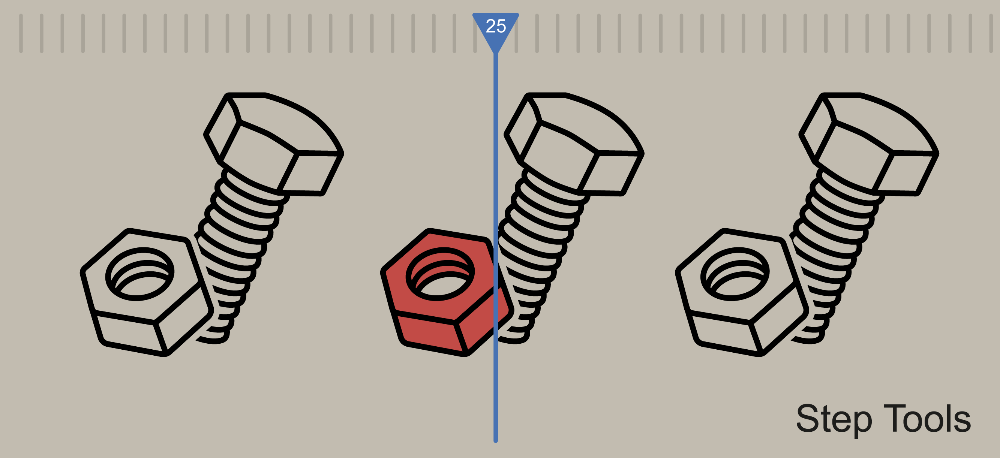
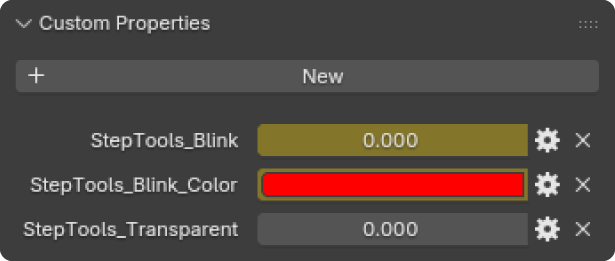
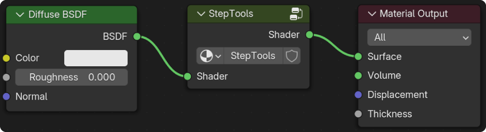
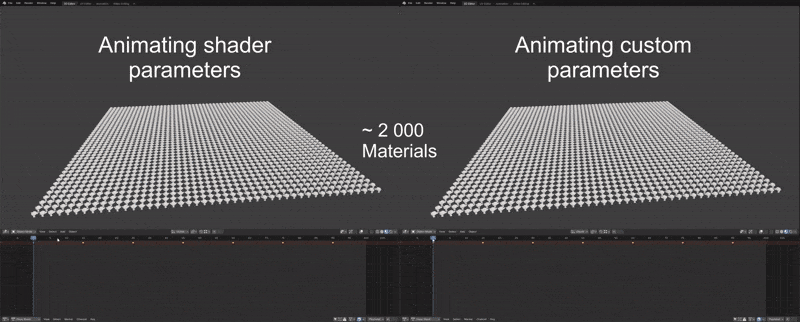

# Step Tools

    

Blender3D addon that automates the process of creating object blink animations.  
Created for use in technical animation.

## Features
- Blinking transparency
- Custom blink color selection
- Adjust blink duration and count
- Quick application of fade effects with customizable settings
- Automatic insertion of markers for easy step separation
- Saving markers to a file to create pauses in the Video Sequencer

    

## How it works
The addon creates several "Custom Properties" and a shader node group with attributes for the selected objects.  
The group is created before the "Material Output" node and does not affect existing shader settings.

    

 

Keyframes are set on the object's "Custom Properties".  
This improves performance when working with a large number of materials.

    

## Installation
Download the .zip file and follow the [official instructions](https://docs.blender.org/manual/en/latest/editors/preferences/addons.html) for installing addons (Install from Disk).

## Download
Link for download [last release](https://github.com/vgmove/step-tools/releases/download/release_v1.0.0/step_tools.zip). 
